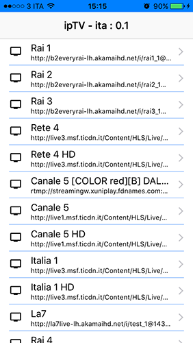
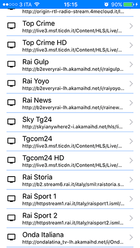

# ipTV
Sample IPTV streaming app for iOS (universal target).  
Based on a googled (non pay-tv) italian channel list.

###Channel list

  
###Live streaming

---

###Playlist format
	[...]
	#EXTINF:0,Italia 1 HD
	http://live3.msf.ticdn.it/Content/HLS/Live/Channel(CH02HA)/Stream(04)/index.m3u8
	[...]
	
###Playlist url
[https://dl.dropboxusercontent.com/u/11796049/piStream/tv-ita.m3u]()

---

###Used pods

	pod "VKVideoPlayer", "~> 0.1.1"
	pod 'AFNetworking', '~> 3.1'
	pod 'MCSwipeTableViewCell', '~> 2.1'

###Requirements
- ARC
- iOS 8.1+

---

###TODO
- Remove broken links from table (swipe cell)

###Known bugs
- Nothing interesting. It's a one shot project.

---

**Have fun.**